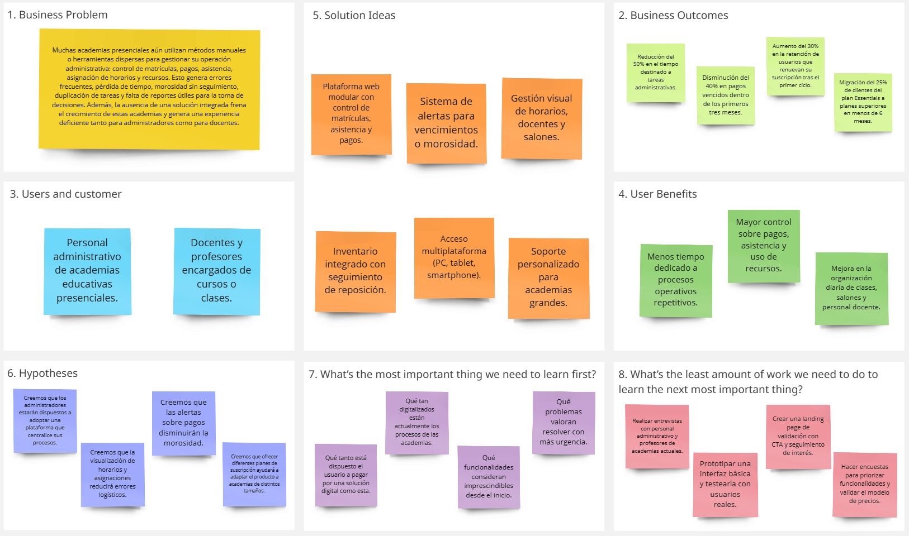

# Capítulo I: Introducción

## 1.2 Solution Profile

### 1.2.2 Lean UX Process

#### 1.2.2.1 Lean UX Problem Statements

La Startup [INSERTAR NOMBRE] tiene como objetivo proporcionar a las instituciones educativas privadas una plataforma web integral que permita automatizar procesos administrativos esenciales, como matrículas, control de asistencia, asignación de horarios, docentes y salones, seguimiento de pagos y gestión de recursos y materiales.

El problema se manifiesta en la manera tradicional y desorganizada con la que muchas academias manejan su administración interna.
Actualmente, la mayoría utiliza herramientas básicas como hojas de Excel, documentos físicos o plataformas que no están integradas entre sí.
Esto genera duplicidad de tareas, falta de trazabilidad, pérdida de información clave, errores en la asignación de recursos y complicaciones en la gestión de pagos y control de asistencia.
Como consecuencia, el personal administrativo invierte un tiempo excesivo en tareas repetitivas, y los docentes enfrentan dificultades para coordinar sus horarios o registrar adecuadamente la asistencia y rendimiento de los alumnos.

Hemos identificado que esta deficiencia en la administración limita seriamente la capacidad de crecimiento y profesionalización de muchas academias.
Además, deteriora la experiencia de alumnos y profesores, y afecta negativamente la percepción del servicio ofrecido.
La ausencia de un sistema unificado también impide tomar decisiones informadas sobre finanzas, rendimiento académico y uso de recursos, generando un impacto directo en la sostenibilidad del negocio.

¿Cómo podríamos centralizar y automatizar la gestión administrativa de academias presenciales de forma escalable y accesible, permitiendo al personal administrativo y docente ahorrar tiempo, reducir errores y mejorar el control sobre los procesos clave del día a día?

#### 1.2.2.2 Lean UX Assumptions

#### Business Assumptions

1. **Creemos que nuestros clientes necesitan** una plataforma web centralizada que les permita automatizar y simplificar su gestión administrativa diaria.
2. **Estas necesidades se pueden resolver con** un sistema web que facilite procesos clave como la matrícula de alumnos, control de asistencia, asignación de horarios, docentes y salones, gestión de inventario y seguimiento de pagos.
3. **Nuestros clientes iniciales serán** los administradores y docentes de academias educativas presenciales pequeñas, medianas y grandes que actualmente operan con métodos manuales o herramientas desarticuladas.
4. **El valor más importante que el cliente quiere de nuestro servicio es** tener mayor control y eficiencia en la administración de su academia, reduciendo la carga operativa y los errores humanos, y facilitando la toma de decisiones con reportes claros.
5. **El cliente también puede obtener beneficios adicionales** [REVISAR] como alertas de pagos vencidos, reportes, seguimiento de inventario para reposición y escalabilidad mediante distintos planes por tamaño de academia.
6. **Vamos a adquirir la mayoría de nuestros clientes mediante** marketing digital dirigido en redes sociales (Facebook, Instagram, TikTok), campañas en Google Ads y alianzas con gremios educativos.
7. **Generaremos dinero a través de** un modelo de suscripción mensual escalable, con tres planes: Essentials $19.90 (academias pequeñas); Pro $69.90 (academias medianas); Elite $159.90 (academias grandes).
8. **Nuestra competencia principal en el mercado son** [REVISAR] sistemas genéricos de gestión escolar, soluciones empresariales o especializadas y hojas de cálculo utilizadas por academias.
9. **Lo venceremos debido a** ofrecer una solución enfocada específicamente en academias presenciales, con una interfaz amigable, soporte local y funciones diseñadas desde el enfoque de sus procesos reales.
10. **El mayor riesgo del servicio es** que las academias, especialmente las pequeñas, no estén dispuestas a migrar desde sus métodos manuales actuales por temor al cambio o falta de conocimiento tecnológico.
11. **Resolveremos esto a través de** [REVISAR] una interfaz simple y guiada, materiales de capacitación, soporte personalizado para la implementación, y un periodo de prueba gratuito para incentivar la adopción.

#### User Assumptions

**¿Quién es el usuario?**

Principalmente el personal administrativo y los docentes de academias educativas que necesitan herramientas accesibles y prácticas para gestionar alumnos, horarios y pagos.

**¿Qué problema tiene nuestro producto que debe resolver?**

El problema radica en el desorden de los procesos administrativos, la pérdida de tiempo por tareas repetitivas, falta de visibilidad sobre pagos y asistencias y dificultad para generar reportes útiles.

**¿Qué características son importantes?**

Destacan principalmente el control de matrículas y asistencia, la asignación de horarios, salones y docentes, alertas de pagos vencidos, reportes automatizados e inventario con seguimiento de stock.

**¿Dónde encaja nuestro producto en su trabajo o vida?**

En el día a día laboral de los administradores y docentes, ayudándolos a organizar, controlar y optimizar la operación de su academia desde un solo lugar.

**¿Cúando y cómo es nuestro producto? ¿Usado?**

[REVISAR]
Será usado todos los días hábiles, especialmente al inicio de clases, al registrar asistencia, gestionar horarios o monitorear pagos.
Accederán desde computadoras o laptops, y en algunos casos desde tablets o smartphones. 

**¿Cómo debe verse nuestro producto y cómo debe comportarse?**

Debe tener una interfaz moderna, clara y adaptable a cualquier dispositivo. La navegación debe ser intuitiva, con acciones guiadas y accesibles para usarlos sin conocimientos técnicos.
El sistema debe responder rápido, enviar notificaciones útiles y garantizar la seguridad de la información.

#### 1.2.2.3 Lean UX Hypothesis Statements

- **Hypothesis 01:**

    **Creemos que** los administradores de academias presenciales estarán dispuestos a adoptar nuestra plataforma web para digitalizar procesos como matrícula, pagos, asistencia y asignación de horarios.
    
    **Sabremos que** hemos tenido éxito.

    **Cuando** al menos el 70% de los usuarios activos usen la plataforma para gestionar estos procesos durante el primer mes de uso, y al menos el 60% renueve su suscripción tras el primer ciclo mensual.

- **Hypothesis 02:**

    [REVISAR]
    **Creemos que** la integración de alertas de morosidad y vencimiento de pagos reducirá significativamente el retraso en los pagos de los alumnos.

    **Sabremos que** hemos tenido éxito.

    **Cuando** el porcentaje de pagos vencidos disminuye en al menos un 40% entre los usuarios que adoptan esta funcionalidad en los primeros tres meses.

- **Hypothesis 03:**

    **Creemos que** permitir la gestión del inventario (como libros, plumones o equipos) dentro del sistema facilitará el control de materiales y reducirá pérdida o faltantes.

    **Sabremos que** hemos tenido éxito.

    **Cuando** al menos el 80% de las academias con más de una sede reporten una mejora en el seguimiento de materiales y una disminución de pérdidas en un periodo de 2 meses.

- **Hypothesis 04:**

    **Creemos que** la interfaz intuitiva y el diseño responsivo de la plataforma aumentará la frecuencia de uso por parte de docentes y personal administrativo, incluso si no tienen experiencia tecnológica previa.

    **Sabremos que** hemos tenido éxito.

    **Cuando** al menos el 75% de los usuarios califiquen la usabilidad de la plataforma como "fácil" o "muy fácil" en las encuestas de satisfacción realizadas durante la fase piloto.

- **Hypothesis 05:**

    **Creemos que** ofrecer planes escalables (Essentials, Pro, Elite) permitirá a las academias elegir el plan adecuado según su tamaño, y facilitará el crecimiento dentro del mismo sistema.

    **Sabremos que** hemos tenido éxito.

    **Cuando** al menos el 25% de los clientes del plan Essentials migren al plan Pro o Elite en los primeros seis meses de uso.

#### 1.2.2.4 Lean UX Canvas

